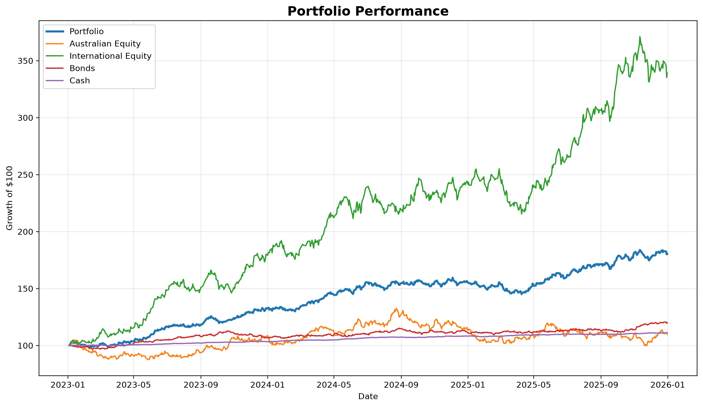
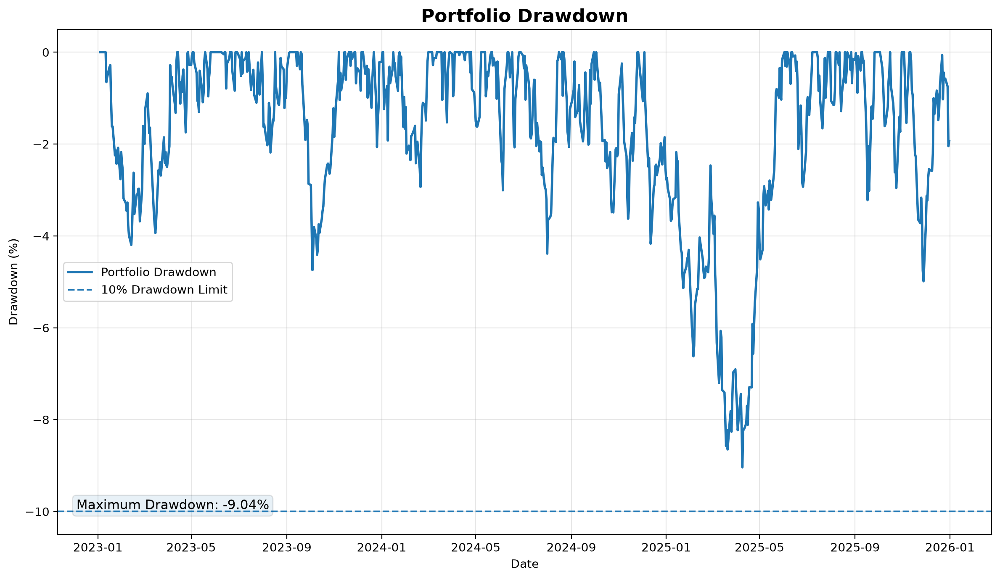
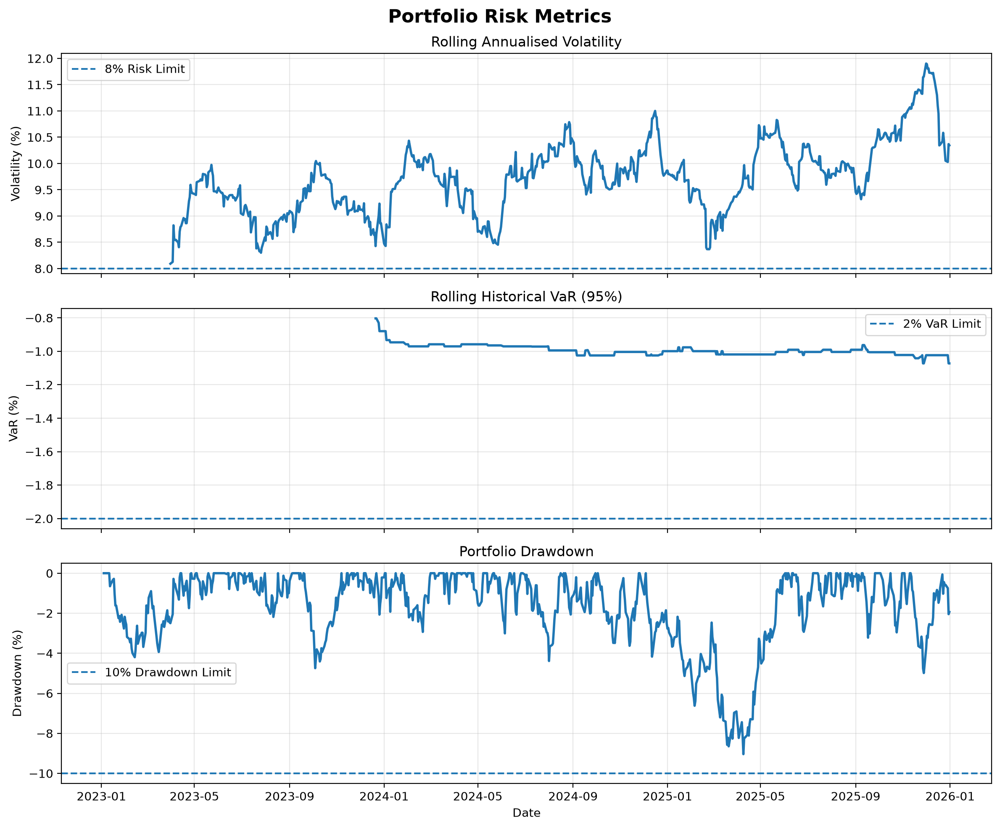
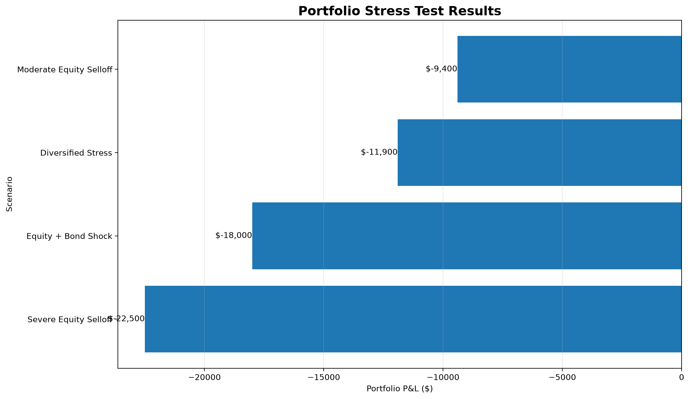
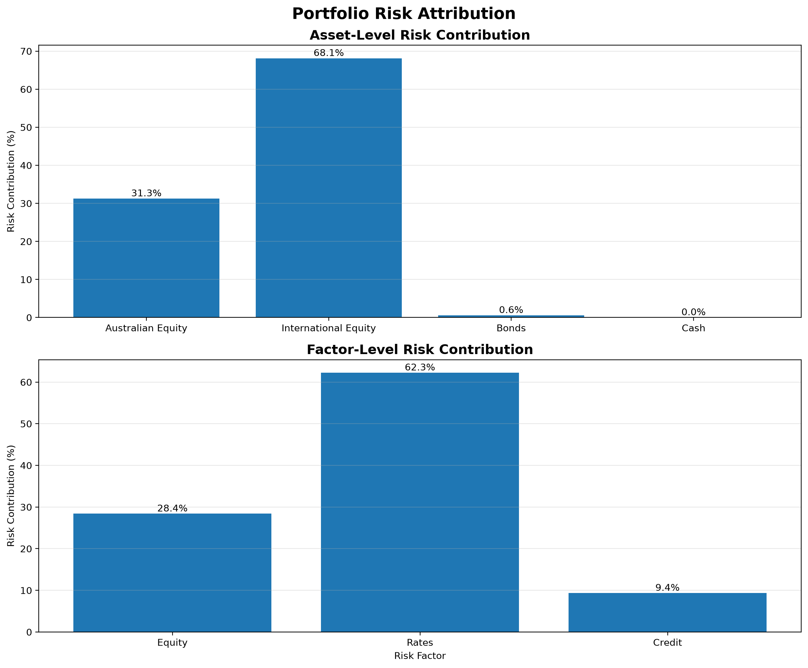

# Portfolio Risk Analytics

A Python-based portfolio analytics project exploring investment
returns, portfolio risk metrics, stress testing, data validation
and analytical reporting.

## Project Overview

This project was developed to strengthen practical Python skills
while applying investment and risk concepts to portfolio analysis.

The project currently covers:

- Portfolio return calculations
- Portfolio risk metrics
- Portfolio dynamics
- Drawdown analysis
- Stress testing
- Factor analysis
- Data validation
- Automated testing
- Analytical reporting

## Technologies

- Python
- pandas
- NumPy
- Matplotlib
- pytest
- Excel

## Project Structure

```text
portfolio-risk-analytics/
├── data/
├── src/
├── tests/
├── generate_data.py
└── README.md


## Portfolio Analytics Outputs

The project generates a set of portfolio analytics outputs covering performance, drawdown, risk metrics and stress testing.

### Portfolio Performance



### Portfolio Drawdown



### Risk Metrics



### Stress Testing



### Risk Attribution

The risk attribution analysis decomposes portfolio risk across both asset classes and underlying risk factors.



### Automated Risk Reporting

The project also generates a structured portfolio risk report in CSV format.

The report consolidates:

- Portfolio risk metrics
- Risk-limit utilisation
- Asset-level risk attribution
- Portfolio factor exposures
- Stress-test scenarios
- Overall risk status

Example output:

`Output/portfolio_risk_report.csv`

The reporting workflow separates analytical calculations from the final reporting layer, allowing the outputs to be consumed by downstream reporting or visualisation tools.